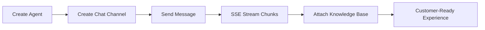

# AI Sandbox SDK for Ruby


## UX-First Value Cards

| Quick Integration | Real-Time Experience | Reliability by Default |
| --- | --- | --- |
| Ruby-native API with low setup overhead | `send_chat_stream(...)` for SSE chunk handling | Retry + timeout controls for service stability |

## Visual Integration Flow



## 60-Second Quick Start

```ruby
require "ai_sandbox_sdk"

client = AiSandboxSdk::Client.new(
  base_url: ENV.fetch("AI_SANDBOX_BASE_URL", "https://www.egroupai.com"),
  api_key: ENV.fetch("AI_SANDBOX_API_KEY", "")
)

agent = client.create_agent(
  "agentDisplayName" => "Support Agent",
  "agentDescription" => "Handles customer inquiries"
)
agent_id = agent.dig("payload", "agentId")

channel = client.create_chat_channel(agent_id, {
  "title" => "Web Chat",
  "visitorId" => "visitor-001"
})
channel_id = channel.dig("payload", "channelId")

chunks = client.send_chat_stream(agent_id, {
  "channelId" => channel_id,
  "message" => "What is the return policy?",
  "stream" => true
})
chunks.each { |chunk| puts chunk }
```

## Installation

```bash
gem install ai-sandbox-sdk-ruby
```

## Integration Sanity Checklist

- Keep `AI_SANDBOX_API_KEY` in secure runtime configuration.
- Confirm `AI_SANDBOX_BASE_URL` points to the intended environment.
- Verify `[DONE]` handling in stream consumers before release.

## Snapshot

| Metric | Value |
| --- | --- |
| API Coverage | 11 operations (Agent / Chat / Knowledge Base) |
| Stream Mode | `text/event-stream` with `[DONE]` handling |
| Retry Safety | 429/5xx auto-retry for GET/HEAD + capped exponential backoff |
| Error Surface | `ApiError` with status/body/trace_id |
| Validation | Production-host integration verified |

## Links

- [Official System Integration Docs](https://www.egroupai.com/ai-sandbox/system-integration)
- [Public Capability Showcase](https://github.com/a6091731/ai-sandbox-public-showcase)
- [30-Day Optimization Plan](docs/30D_OPTIMIZATION_PLAN.md)
- [Integration Guide](docs/INTEGRATION.md)
- [Quickstart Example](examples/quickstart.rb)
- [Repository](https://github.com/eGroupAI/ai-sandbox-sdk-ruby)

## License

This SDK is released under the Apache-2.0 license.
